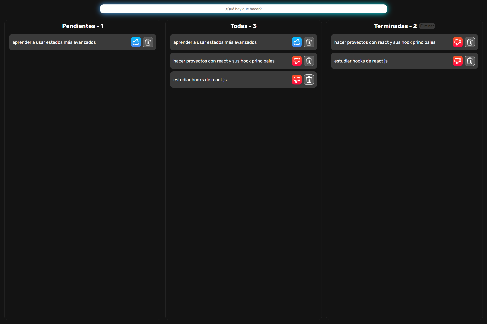
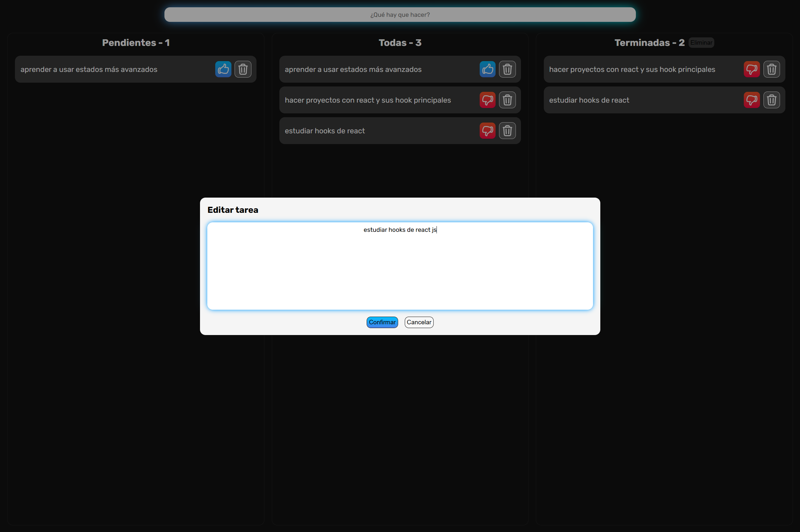

# Todo App

TodoApp desarrollada en react, aplicando lo aprendido en el curso de Fernando Herrera, donde utilicé hooks como:
- useState
- useEffect
- useReducer
- useContext

Además, las tareas son guardadas en el localStorage.

Características:
- agregar tarea
- actualizar descripción de tarea
- actualizar estado de tarea
- eliminar tarea
- Diseño responsivo

Resultados:

